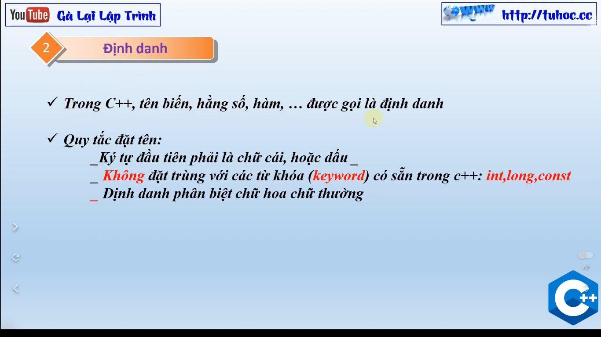

# 3. Kiểu dữ liệu trong C++ - Các kiểu dữ liệu cơ bản - giải thích Kiểu dữ liệu cơ sở C++

"Chào mừng đến với clip mới của tôi trên kênh Youtube! Trong clip này, tôi sẽ giới thiệu về các kiểu dữ liệu trong ngôn ngữ lập trình C++. C++ là một ngôn ngữ lập trình phổ biến và mạnh mẽ, và các kiểu dữ liệu là một trong những thành phần quan trọng nhất trong ngôn ngữ này. Trong clip này, tôi sẽ giải thích các kiểu dữ liệu cơ bản trong C++, bao gồm kiểu số nguyên, kiểu thực, kiểu ký tự và kiểu chuỗi. Tôi cũng sẽ giải thích các quy tắc về cách sử dụng chúng và các hạn chế của chúng. Nếu bạn là một người mới bắt đầu học C++ hoặc muốn tìm hiểu thêm về các kiểu dữ liệu trong ngôn ngữ này, hãy xem clip của tôi và hãy để lại những bình luận của bạn sau khi xem!"

---

