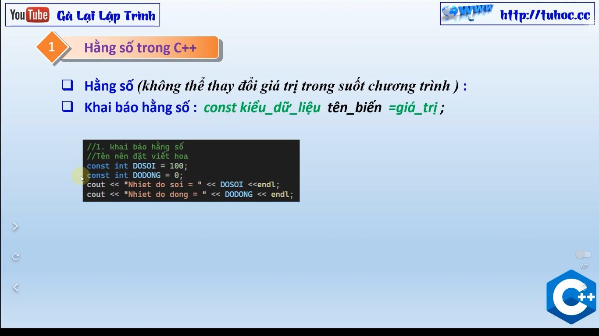
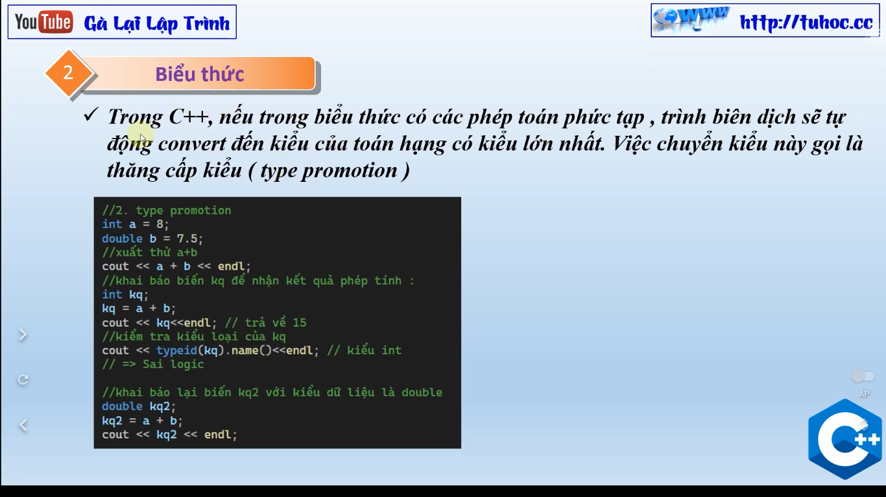

# 4. Hằng số và biểu thức trong C++ - Constants C++ - lập trình C++ cho người mới

"Chào mừng đến với clip mới của tôi trên kênh Youtube! Trong clip này, tôi sẽ giới thiệu về hằng số và biểu thức trong ngôn ngữ lập trình C++. C++ là một ngôn ngữ lập trình phổ biến và mạnh mẽ, và hằng số và biểu thức là hai thành phần quan trọng trong ngôn ngữ này. Trong clip này, tôi sẽ giải thích cách sử dụng hằng số trong C++ bằng cách sử dụng từ khóa 'const' và cách sử dụng biểu thức để thực hiện các tính toán trong chương trình C++. Tôi sẽ giải thích các quy tắc về cách sử dụng chúng và các hạn chế của chúng. Nếu bạn là một người mới bắt đầu học C++ hoặc muốn tìm hiểu thêm về hằng số và biểu thức trong ngôn ngữ này, hãy xem clip của tôi và hãy để lại những bình luận của bạn sau khi xem!"

---

