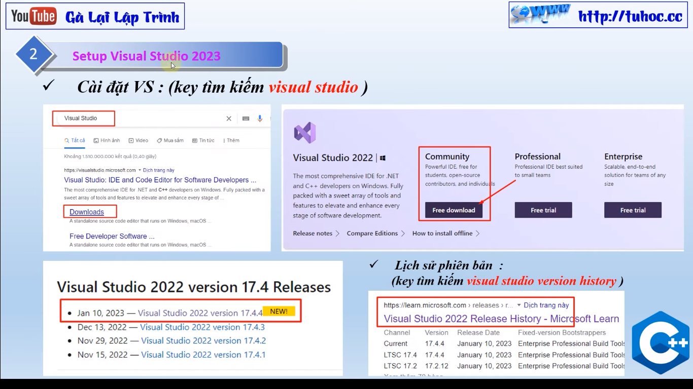

# 1. Lập trình C++, cài đặt visual studio 2023 - lập trình C++ 2023 cho người mới

Chào mừng mọi người đến với kênh YouTube tuhoc.cc của tôi. Trong seri này, tôi sẽ chia sẻ những kiến thức và kinh nghiệm của mình về lập trình C++ trong môi trường Visual Studio 2023. Đặc biệt, tôi sẽ giảng dạy cho các bạn cách lập trình C++ dành cho người mới, giúp các bạn có thể hiểu được các khái niệm cơ bản và các kỹ thuật mới nhất của ngôn ngữ này.

Lập trình C++ là một ngôn ngữ lập trình rất mạnh mẽ và phổ biến, được sử dụng trong rất nhiều lĩnh vực khác nhau như lập trình hệ điều hành, game, đồ họa, học thuật, khoa học và công nghệ. Trong kênh của tôi, tôi sẽ hướng dẫn các bạn cách sử dụng Visual Studio 2023 để tạo ra các chương trình C++. Tôi sẽ giảng dạy các khái niệm cơ bản như cấu trúc cảnh, biến, hàm, vòng lặp, mảng và chuỗi. Tôi cũng sẽ giới thiệu các kỹ thuật mới nhất như lập trình hướng đối tượng, STL và các thư viện
Trong kênh của tôi, các bạn sẽ tìm thấy rất nhiều video hướng dẫn chi tiết về cách sử dụng Visual Studio 2023 để tạo ra các chương trình C++. Tôi sẽ hướng dẫn các bạn cách tạo project, cấu hình, debug và chạy chương trình. Tôi cũng sẽ giảng dạy các bạn cách sử dụng các công cụ như IntelliSense, Code Map và Code Lens để giúp cho việc lập trình dễ dàng hơn.

Ngoài ra, tôi cũng sẽ chia sẻ với các bạn những ví dụ thực tế về cách lập trình C++ để giúp các bạn hiểu rõ hơn về các khái niệm và kỹ thuật mà tôi đã giảng dạy. Các ví dụ này sẽ bao gồm các chương trình đơn giản như in ra màn hình, tính toán, học thuật.....

Tôi hy vọng rằng kênh của tôi sẽ giúp cho các bạn có thể học được lập trình C++ trong môi trường Visual Studio 2023 một cách dễ dàng và thú vị. Hãy đăng ký kênh và theo dõi các video mới nhất của tôi để cập nhật vdieo mới nhất!

---

