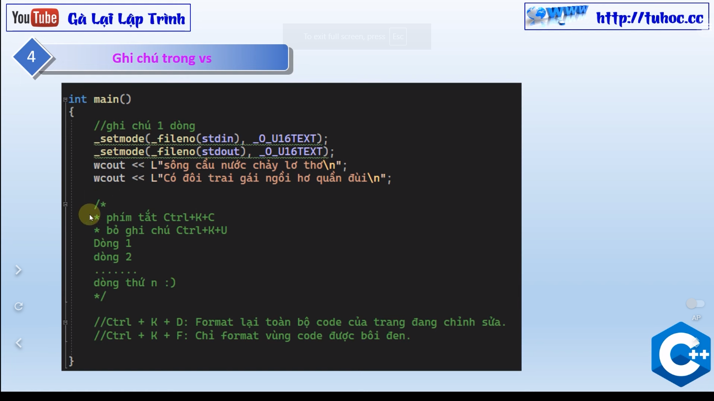

# 2. Lập trình C++ | nhập xuất dữ liệu C++ | Thiết lập gõ tiếng việt, chỉnh font chữ, cỡ chữ vs 2023

Chào mừng đến với kênh YouTube Tuhoc.cc của tôi! Trong kênh này, tôi sẽ chia sẻ những video hướng dẫn về lập trình C++ và thiết lập môi trường lập trình.
Trong video đầu tiên, tôi sẽ hướng dẫn cách thiết lập gõ tiếng Việt trên môi trường lập trình, bao gồm cả cách chỉnh font chữ, cỡ chữ và hiển thị số dòng.
Ngoài ra, tôi cũng sẽ hướng dẫn cách nhập xuất dữ liệu trong C++, giúp cho các bạn có thể sử dụng dữ liệu từ nguồn khác trong chương trình của mình.
Hãy theo dõi kênh của tôi để cập nhật những video mới nhất và học hỏi nhiều kiến thức hơn về lập trình C++.

---

